```mermaid
erDiagram
	direction TB
	research_session {
		Int id PK ""
		String public_id UK ""
		String name "optional"
		Boolean completed ""
		DateTime completed_at "optional; setado uma vez, quando completed vira true"
		String patent_source "optional"
		String scholarly_source "optional"
		Int current_step "passo do wizard onde a sessão parou (retomada)"
		Int current_substep "optional; subpasso do wizard (retomada)"
		Float relevance_threshold ""
		DateTime created_at ""
		DateTime updated_at ""
	}

	session_input {
		Int id PK ""
		Int session_id FK ""
		Int parent_id FK "optional; self - refino do input raiz"
		String theme ""
		Text description "optional"
		String area_of_study "optional"
		JSON keywords "optional"
		Int year_from "optional"
		Int year_to "optional"
		Int iterations ""
	}

	session_probe_query {
		Int id PK ""
		Int session_id FK "UK composta"
		String fonte "UK composta; ops | scopus"
		String tipo "optional; UK composta; null=probe | specific|balanced|generic"
		Int parent_id FK "optional; self - query final refina a query probe"
		Text query_text ""
		JSON fields "optional"
		Int year_from "optional"
		Int year_to "optional"
		Float complexity_score "optional"
		String complexity_level "optional"
		Int result_count "optional; tamanho da amostra baixada"
		Int iterations ""
		DateTime created_at ""
	}

	session_ai_call {
		Int id PK ""
		Int session_id FK ""
		String step ""
		String provider ""
		String model ""
		Float duration_ms ""
		Int input_tokens "optional"
		Int output_tokens "optional"
		Int total_tokens "optional"
		Int attempts ""
		DateTime created_at ""
	}

	patent {
		Int id PK ""
		String dedup_key UK ""
		String source ""
		String source_record_id "optional"
		Text title ""
		Text abstract "optional"
		String publication_number "optional"
		String application_number "optional"
		String family_id "optional"
		JSON applicants "optional"
		JSON inventors "optional"
		JSON ipc_codes "optional"
		JSON cpc_codes "optional"
		String filing_date "optional"
		String publication_date "optional"
		String grant_date "optional"
		Int year "optional"
		String legal_status "optional"
		String country "optional"
		DateTime created_at ""
	}

	article {
		Int id PK ""
		String dedup_key UK ""
		String source ""
		String source_record_id "optional"
		Text title ""
		Text abstract "optional"
		String doi "optional"
		JSON authors "optional"
		JSON affiliations "optional"
		JSON affiliation_countries "optional"
		String journal_or_source "optional"
		String volume "optional"
		String issue "optional"
		String pages "optional"
		String publication_date "optional"
		Int year "optional"
		JSON keywords "optional"
		JSON field_of_study "optional"
		Int citations "optional"
		DateTime created_at ""
	}

	probe_query_patent {
		Int id PK ""
		Int probe_query_id FK "UK composta"
		Int patent_id FK "UK composta"
		Float relevance_score "optional"
		DateTime created_at ""
	}

	probe_query_article {
		Int id PK ""
		Int probe_query_id FK "UK composta"
		Int article_id FK "UK composta"
		Float relevance_score "optional"
		DateTime created_at ""
	}

	probe_query_term {
		Int id PK ""
		Int probe_query_id FK "UK composta"
		String term "UK composta"
		Float score ""
		Int frequency ""
		Boolean selected ""
		DateTime created_at ""
	}

	session_chart {
		Int id PK ""
		Int probe_query_id FK "UK composta"
		String document_type "patent | article"
		String chart_type "UK composta; s_curve|yearly_volume|top_depositants|top_institutions|top10_heatmap"
		String object_key "PNG no MinIO"
		String content_type ""
		Int projection_years "optional; só s_curve"
		JSON fit_quality "optional; só s_curve: r_squared/reliable/warning"
		JSON summary "optional; resumo numérico do gráfico (texto dos Resultados)"
		DateTime created_at ""
		DateTime updated_at ""
	}

	session_report_section {
		Int id PK ""
		Int session_id FK "UK composta"
		String section_key "UK composta; objetivo|introducao|informacoes_*|tendencias_ciclo_vida|conclusao|finalidade|metodologia|..."
		Text rag_context "optional; trechos do RAG enviados ao LLM"
		JSON sources "optional; citações (AUTOR, ano) + entrada ABNT"
		Text generated_text "optional; já escapado para LaTeX"
		String status ""
		DateTime created_at ""
		DateTime updated_at ""
	}

	session_report {
		Int id PK ""
		Int session_id FK ""
		String tex_object_key "main.tex no MinIO (+ main.assembled.tex)"
		String pdf_object_key "optional"
		String status "tex_ready | complete | pdf_failed"
		JSON assemble_payload "optional; capa/assinaturas/quadro - reusado no Remontar"
		DateTime created_at ""
		DateTime updated_at ""
	}

	app_settings {
		String key PK "ex.: rag_relative_min_relevance, languagetool_language"
		Text value ""
		String value_type ""
		String category ""
		Boolean is_secret ""
		Float min_value "optional"
		Float max_value "optional"
		Float step "optional"
		String label "optional"
		Text description "optional"
		Text default_value "optional"
		DateTime updated_at ""
	}

	llm_provider_configs {
		Int id PK ""
		String provider_code "UK composta"
		String model "UK composta"
		String api_key ""
		String base_url "UK composta"
		DateTime created_at ""
		DateTime updated_at ""
	}

	llm_call_site_bindings {
		String call_site PK "theme_candidates|probe_query|final_query|report_writing|report_review"
		Int config_id FK ""
		DateTime updated_at ""
	}

	search_api_selection {
		String family PK "patent | scholarly"
		String active_provider_code ""
		DateTime updated_at ""
	}

	research_session||--o{session_input:"define"
	session_input||--o{session_input:"refina"
	research_session||--o{session_probe_query:"executa"
	session_probe_query||--o{session_probe_query:"refina"
	research_session||--o{session_ai_call:"registra"
	session_probe_query||--o{probe_query_patent:"encontra"
	patent||--o{probe_query_patent:"aparece em"
	session_probe_query||--o{probe_query_article:"encontra"
	article||--o{probe_query_article:"aparece em"
	session_probe_query||--o{probe_query_term:"extrai"
	session_probe_query||--o{session_chart:"gera gráfico"
	research_session||--o{session_report_section:"redige seção"
	research_session||--o|session_report:"monta relatório"
	llm_provider_configs||--o{llm_call_site_bindings:"atende"
```

# Diagrama do Banco de Dados — Prospecção Tecnológica (PFC)

> Gerado por `scripts/generate_db_schema_docs.py` a partir dos modelos SQLAlchemy — não editar à mão.

## Como visualizar

### Opção 1 — mermaid.live (sem instalar nada)
1. Acesse **https://mermaid.live**
2. Apague o conteúdo do painel esquerdo
3. Cole o bloco Mermaid abaixo (sem os três backticks)
4. O diagrama aparece ao vivo no painel direito

### Opção 2 — VS Code
Instale a extensão **Markdown Preview Mermaid Support** (`bierner.markdown-mermaid`) e pressione `Ctrl+Shift+V` neste arquivo.

---

---

## Observações importantes

Este banco **não é um esquema único** — são quatro grupos de tabelas que coexistem no código:

| # | Grupo | Arquivo | Situação |
|---|-------|---------|----------|
| 1 | **Sessão de prospecção** (`research_session` → `session_input`, `session_probe_query`, `session_ai_call`, `patent`, `article`, `probe_query_*`, `session_chart`, `session_report_section`, `session_report`) | `db/research_session_models.py` | **Ativo** — gerenciado via Alembic (`alembic upgrade head`). |
| 2 | **Documentos genéricos** (`scholarly_documents`, `patent_documents`, `*_dedup_registry`) | `db/models.py` | Legado, usado pelos adapters de persistência antigos; sem FK para o grupo 1. Fora do diagrama. |
| 3 | **Research legado** (`research`, `research_*`) | `db/research_models.py` | Desenho anterior ao modelo session-centric. Fora do diagrama. |
| 4 | **Configuração editável** (`app_settings`, `llm_provider_configs`, `llm_call_site_bindings`, `search_api_selection`) | `db/config_models.py` | Ativo — criado por `create_all` e populado por `db/config_seed.py` (idempotente: `seed_missing_app_settings`/`seed_missing_call_site_bindings` completam bancos existentes). |

Pontos do schema ativo (grupo 1):
- `session_input.parent_id` e `session_probe_query.parent_id` são auto-relacionamentos: a linha raiz é o input/probe, a filha é o refino/query final (`tipo = specific|balanced|generic`). UK de `session_probe_query`: `session_id + fonte + tipo`.
- `patent`/`article` são deduplicados globalmente — a mesma patente encontrada por duas queries gera **uma** linha em `patent` e **duas** em `probe_query_patent`.
- `probe_query_term` guarda os termos extraídos por NLP local (padrões gramaticais + BM25F + KeyBERT, fundidos por RRF) de uma probe query; `selected` marca os escolhidos para a query final.
- `session_chart`: um PNG por (query final, tipo de gráfico) no MinIO. `summary` (JSON) guarda o resumo numérico calculado das mesmas contagens do desenho — é o que o LLM recebe para comentar a figura nos Resultados; na curva S inclui os anos GP/MP/SP usados para o estágio do ciclo de vida.
- `session_report_section`: uma linha por seção do relatório. Seções de IA passam por `rag_context` → `generated_text`; `sources` guarda as citações (AUTOR, ano) dos documentos recuperados, usadas para validar o texto e gerar as Referências. Finalidade, Objetivo escrito pelo usuário, Metodologia e Referências Bibliográficas são gravadas pela rota de seções estáticas.
- `session_report`: o `.tex` montado (`tex_object_key`), o PDF (`pdf_object_key`) e o `assemble_payload` (capa, assinaturas `nome/posto/funcao`, quadro de busca com o total real) reaproveitado pelo "Remontar .tex". Uma cópia da versão montada (`main.assembled.tex`, no MinIO) serve de referência para a revisão detectar as edições do usuário.
- Anexos do editor ficam só no MinIO (`sessions/{id}/report/attachments/`), sem tabela.
