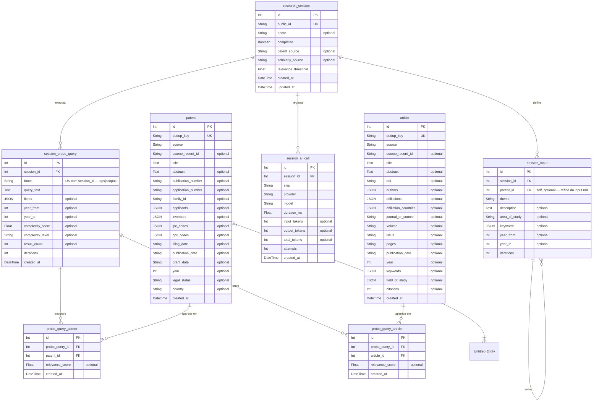

# Diagrama do Banco de Dados — Prospecção Tecnológica (PFC)

## Como visualizar

### Opção 1 — mermaid.live (sem instalar nada)
1. Acesse **https://mermaid.live**
2. Apague o conteúdo do painel esquerdo
3. Cole o bloco Mermaid abaixo (sem os três backticks)
4. O diagrama aparece ao vivo no painel direito

### Opção 2 — VS Code
Instale a extensão **Markdown Preview Mermaid Support** (`bierner.markdown-mermaid`) e pressione `Ctrl+Shift+V` neste arquivo.

---

---

## Observações importantes

Este banco **não é um esquema único** — são três grupos de tabelas que coexistem hoje no código, sem chave estrangeira alguma ligando um grupo ao outro:

| # | Grupo | Arquivo | Situação |
|---|-------|---------|----------|
| 1 | **Sessão de prospecção** (`research_session` → `session_input`, `session_probe_query`, `session_ai_call`, `patent`, `article`) | `db/research_session_models.py` | **Ativo e em evolução** — gerenciado via Alembic, é o que está sendo construído agora. |
| 2 | **Documentos genéricos** (`scholarly_documents`, `patent_documents`, `*_dedup_registry`) | `db/models.py` | Ainda em uso pelos adapters de persistência (`patent_repository_adapter.py`, `scholarly_repository_adapter.py`), mas independente de sessão — junção feita por convenção via `dedup_key`/`document_id`, sem FK real. |
| 3 | **Research legado** (`research` → `research_patent_documents`, `research_scholarly_documents`, `research_metrics`, `research_phases`, `research_token_usage`) | `db/research_models.py` | Desenho anterior ao modelo session-centric. Ainda montado e usado por `research_router.py`, `report_router.py` e `metrics_aggregator.py` — é de onde vêm métricas e relatório hoje, já que o grupo 1 ainda não tem equivalente pra isso. |

Pontos que valem atenção ao evoluir o schema ativo (grupo 1):
- `session_metrics` e `session_asset` (que existiam num desenho anterior do grupo 1) **não foram implementados** — métricas e assets de sessão não têm tabela própria ainda.
- `llm_candidate` e `search_run` do desenho anterior saíram do modelo: o refino de estratégia virou o auto-relacionamento `session_input.parent_id` (linha raiz = input do usuário, linha filha = versão refinada escolhida), e cada execução de busca por fonte virou uma linha em `session_probe_query` (uma por sessão+fonte, não uma por tentativa).
- `patent`/`article` (grupo 1) são deduplicados globalmente — a mesma patente encontrada por duas probe queries diferentes gera **uma linha** em `patent` e **duas linhas** em `probe_query_patent`.
